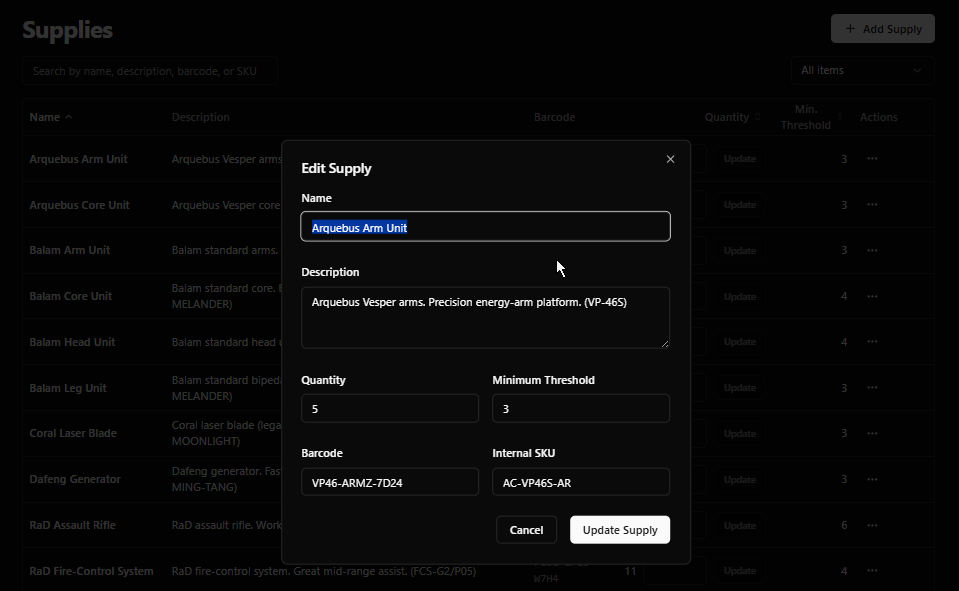

# Supli Mart

Inventory management for tracking supplies, approving requests, and recording consumption — with vendor lead times, MOQ, and a barcode **kiosk** for walk-up checkout.

Built with **Next.js 14** (App Router), **Prisma**, **PostgreSQL (Neon)**, **NextAuth**, and **shadcn/ui**.

---

## Screenshots

### Admin dashboard

Stats, request trends, and low-stock visibility for admins.


### Inventory management

Search and edit supplies with quantity, minimum threshold, barcode, and internal SKU. Quantity can also be updated inline from the list.



### Supply requests

Staff submit requests; admins approve or deny. Statuses: **Pending**, **Approved**, **Denied**.


### Kiosk mode

Dedicated touch-friendly flow for consuming stock on the floor: **Scan item → Enter quantity → Complete**.


### Notifications

In-app bell with unread badge for registration approvals, low-stock alerts, and request status updates.


---

## Features

| Area | What you get |
|------|----------------|
| **Inventory** | CRUD for supplies; barcode & SKU; min thresholds; inline qty updates; search |
| **Requests** | Staff request workflow with admin approve/deny |
| **Kiosk** | PIN-gated barcode scan to consume stock (stock movement ledger) |
| **Locations** | Warehouses, cages, tool rooms, and per-location stock levels |
| **Vendors** | Vendor catalog with cost, lead time, MOQ, preferred links |
| **Dashboards** | Admin overview charts, depletion estimates / forecasting signals |
| **Identity** | Username/password (NextAuth), roles **ADMIN** / **STAFF** / **PENDING**, self-registration, admin approval, invites, password reset |
| **Admin** | Users, audit log, system settings, theme preferences |
| **Notifications** | Header bell with unread count — registration requests, low stock, request status |
| **Export** | CSV export of supplies |

Roles:

- **ADMIN** — full inventory, users, locations, vendors, requests, settings, audit
- **STAFF** — view supplies, submit/manage their requests, use shared app surface

---

## Tech stack

| Layer | Technology |
|-------|------------|
| App | Next.js 14 (App Router), TypeScript |
| Data | Prisma 5, PostgreSQL (Neon) |
| Auth | NextAuth.js (credentials / JWT) |
| UI | Tailwind CSS, shadcn/ui, Radix, Recharts |
| Email | Resend (optional; invites & password reset) |
| Deploy | Vercel, Render, or [Koyeb](koyeb.toml) |

More detail: [docs/architecture.md](docs/architecture.md) · [docs/schema.md](docs/schema.md) · [docs/api.md](docs/api.md) · [docs/roadmap.md](docs/roadmap.md)

---

## Getting started

### Prerequisites

- Node.js 20+
- A PostgreSQL database (Neon works well)

### Setup

```bash
cp .env.example .env
# Fill in DATABASE_URL, NEXTAUTH_SECRET, NEXTAUTH_URL
# Optional: RESEND_API_KEY / EMAIL_FROM for email flows

npm install
npx prisma migrate dev
npm run db:seed          # demo users + sample inventory
npm run dev
```

Open [http://localhost:3000](http://localhost:3000) — the landing page with sign-in and registration links.

### Seed logins

| Username | Password   | Role  |
|----------|------------|-------|
| `walter` | `admin123` | Admin |
| `carla`  | `admin123` | Admin |
| `raven`  | `staff123` | Staff |
| `rusty`  | `staff123` | Staff |
| `iguazu` | `staff123` | Staff |

Kiosk PIN (change under **Admin → Settings**): `kiosk1234`

### Scripts

| Command | Purpose |
|---------|---------|
| `npm run dev` | Dev server |
| `npm run build` | Generate Prisma client, migrate, production build |
| `npm start` | Run production server |
| `npm run db:seed` | Seed demo data |
| `npm test` | Vitest |
| `npm run typecheck` | TypeScript check |
| `npm run lint` | ESLint |

---

## App surfaces

| Path | Audience |
|------|----------|
| `/login` | Sign-in |
| `/register` | Self-registration (pending admin approval) |
| `/forgot-password` | Request password reset email |
| `/dashboard` | Staff overview (admins are sent to `/admin`) |
| `/dashboard/supplies` | Browse inventory |
| `/dashboard/requests` | Create and track requests |
| `/kiosk` | Floor consume flow (PIN) |
| `/admin` | Admin dashboard & management (users, supplies, locations, vendors, requests, audit, settings) |

---

## Environment

See [`.env.example`](.env.example):

- `DATABASE_URL` — Neon / Postgres connection string  
- `NEXTAUTH_SECRET` / `NEXTAUTH_URL` — auth  
- `RESEND_API_KEY` / `EMAIL_FROM` — email (invites, reset)  
- `STORAGE_*` — file attachments when enabled  

---

## License

[MIT](LICENSE) — see [LICENSE](LICENSE) for details.
