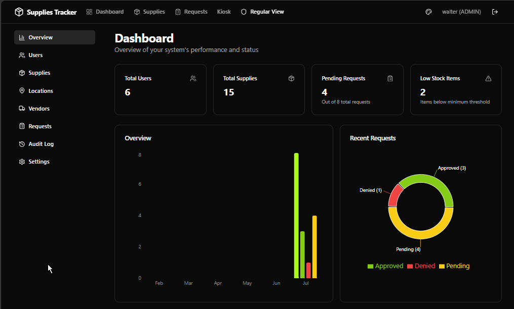
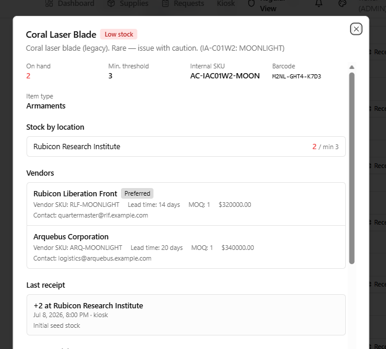
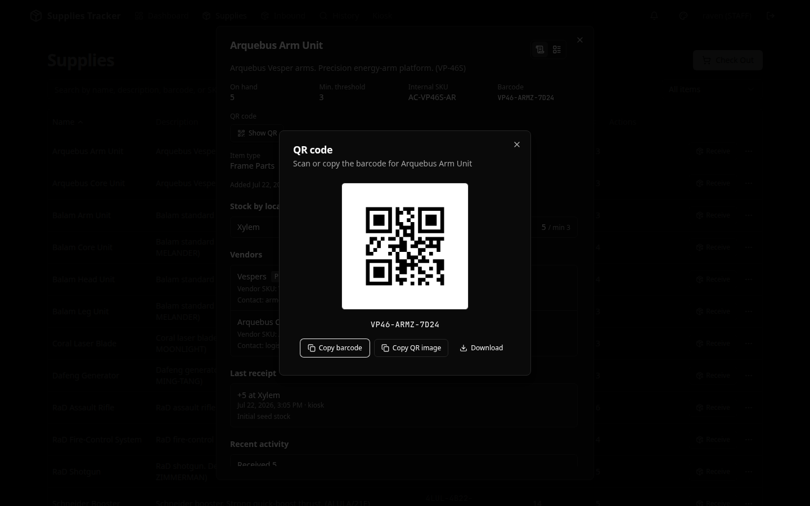
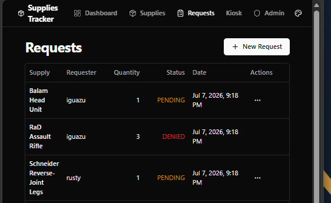
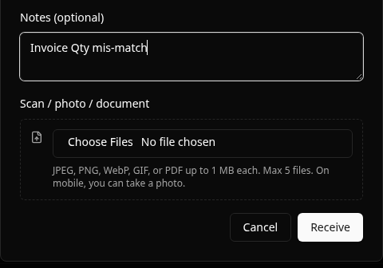
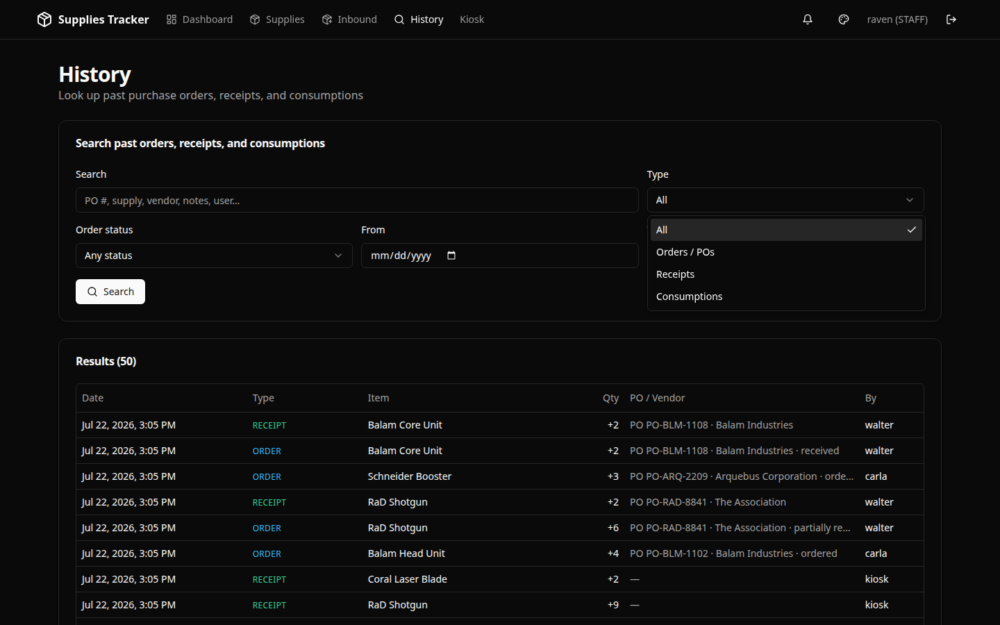
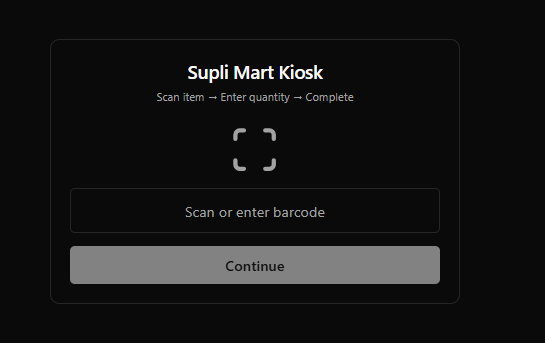
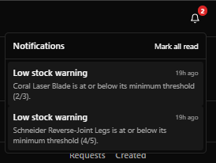
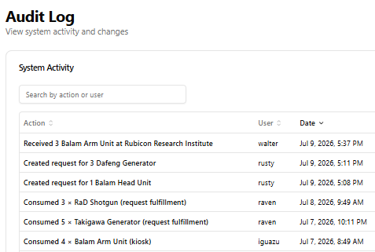

# Supli Mart

Inventory management for tracking supplies, logging inbound corporate POs, receiving stock (with photo/document attachments), searching history, and recording consumption — with vendor lead times, MOQ, barcode **QR** codes, and a **kiosk** for walk-up checkout.

Built with **Next.js 15** (App Router), **Prisma**, **PostgreSQL**, **Auth.js (next-auth v5)**, and **shadcn/ui**. Designed for **onsite / LAN** deploy (bare-metal or Docker Postgres). Cloud (Neon + Vercel / Render / Koyeb) is optional.

---

## Screenshots

### Admin dashboard

Stats, request trends, and low-stock visibility for admins.



### Supply details

Click any supply to see on-hand quantity, stock by location, vendor lead times and MOQ, last receipt, and recent activity — without leaving the list.



### QR code

From any supply detail popup, open **Show QR** to scan, copy, or download the item barcode as a QR image.



### Inbound

Staff receive stock or log a PO placed in the corporate system from one **Inbound** surface. Admins can also approve or deny leftover supply requests.



### Receive attachments

When receiving stock, attach a scan, photo, or PDF (invoice, packing slip, etc.) alongside optional notes.



### History

Search past purchase orders, receipts, and consumptions by PO #, supply, vendor, notes, user, type, status, or date range.



### Kiosk mode

Dedicated touch-friendly flow for consuming stock on the floor: **Scan item → Enter quantity → Complete**.



### Notifications

In-app bell with unread badge for registration approvals, low-stock alerts, and request status updates.



### Audit log

Searchable activity trail for stock receipts, inbound orders, leftover request approvals, and kiosk consumption — who did what and when.



---

## Features

| Area | What you get |
|------|----------------|
| **Inventory** | CRUD for supplies; barcode & SKU; QR from item detail; min thresholds; vendors & activity; search |
| **Inbound** | Receive stock (with photo/document attachments), log corporate POs, track open orders; admin approve/deny leftover requests |
| **History** | Search past POs, receipts, and consumptions by text, type, status, and date |
| **Kiosk** | PIN-gated barcode scan to consume stock (stock movement ledger) |
| **Locations** | Warehouses, cages, tool rooms, and per-location stock levels |
| **Vendors** | Vendor catalog with cost, lead time, MOQ, preferred links |
| **Dashboards** | Admin overview charts, depletion estimates / forecasting signals |
| **Identity** | Username/password (NextAuth), roles **ADMIN** / **STAFF** / **PENDING**, self-registration, admin approval, invites, password reset |
| **Admin** | Users, audit log, system settings, theme preferences |
| **Notifications** | Header bell with unread count — registration requests, low stock, request status |
| **Export** | CSV export of supplies |

Roles:

- **ADMIN** — full inventory, users, locations, vendors, inbound (including request approvals), settings, audit
- **STAFF** — view supplies, receive/log inbound orders, use shared app surface

---

## Tech stack

| Layer | Technology |
|-------|------------|
| App | Next.js 15 (App Router), TypeScript |
| Data | Prisma 5, PostgreSQL 16 (bare-metal or Docker onsite; Neon optional) |
| Auth | Auth.js / next-auth v5 (credentials / JWT) |
| UI | Tailwind CSS, shadcn/ui, Radix, Recharts |
| Email | Resend (optional; without keys, email is logged and skipped) |
| Onsite | Docker Compose and/or host Postgres + Node — see [docs/onsite.md](docs/onsite.md) |
| Edge | Optional: Vercel, Render, or [Koyeb](koyeb.toml) + hosted Postgres |

More detail: [docs/architecture.md](docs/architecture.md) · [docs/schema.md](docs/schema.md) · [docs/api.md](docs/api.md) · [docs/roadmap.md](docs/roadmap.md)

---

## Getting started

**Onsite is the primary target.** Cloud is optional.

| Target | Database | App |
|--------|----------|-----|
| **Onsite (Docker DB)** | `compose.yaml` Postgres | `npm run dev` / `npm start` on the host |
| **Onsite (bare-metal DB)** | OS PostgreSQL | same |
| **Onsite (appliance)** | Compose | Compose `--profile full` (`npm run local:up`) |
| **Edge / cloud** (optional) | Neon / hosted Postgres | Vercel, Render, or Koyeb |

Full walkthrough: **[docs/onsite.md](docs/onsite.md)**.

### Prerequisites

- Node.js 20+
- PostgreSQL 16 — either Docker Compose **or** an OS/package install
- Docker only if you want containerized Postgres / full-stack Compose

### Fastest onsite bring-up

```bash
cp .env.example .env
chmod +x scripts/*.sh
./scripts/onsite-up.sh --docker-db --seed   # or --host-db --seed
npm run build && npm start
```

Open [http://localhost:3000](http://localhost:3000). For LAN clients set `NEXTAUTH_URL=http://<server-ip>:3000`.

### Local setup (Docker Postgres + Next on the host)

```bash
cp .env.example .env
# Defaults point at local Postgres. Set NEXTAUTH_SECRET:
#   openssl rand -base64 32

npm install
npm run db:up            # start Postgres on localhost:5432
npm run db:setup         # migrate + seed demo data
npm run dev
```

### Local setup (bare-metal Postgres)

```bash
# Ubuntu example: sudo apt install postgresql postgresql-contrib && sudo systemctl enable --now postgresql
cp .env.example .env
openssl rand -base64 32   # → NEXTAUTH_SECRET
npm run db:host-setup     # creates role/db supli/supli
npm install
npm run db:setup
npm run dev
```

### Full local server (Postgres + app in Docker)

```bash
cp .env.example .env
# Set NEXTAUTH_SECRET (and optional SUPERADMIN_* / Resend vars)

npm run local:up         # build & start postgres + app
npm run local:seed       # demo users + sample inventory
```

App: [http://localhost:3000](http://localhost:3000). Stop with `npm run local:down`.

### Edge / cloud setup (optional)

```bash
cp .env.example .env
# Set DATABASE_URL to your Neon (or other) connection string (sslmode=require)
# Set NEXTAUTH_SECRET and NEXTAUTH_URL to your public URL

npm install
npx prisma migrate deploy
npm run db:seed          # optional on first boot
npm run build && npm start
```

Or deploy with the existing [render.yaml](render.yaml) / [koyeb.toml](koyeb.toml) configs — same env vars, no Docker required on the host.

### Seed logins

| Username | Password   | Role  |
|----------|------------|-------|
| `walter` | `admin123` | Admin |
| `carla`  | `admin123` | Admin |
| `raven`  | `staff123` | Staff |
| `rusty`  | `staff123` | Staff |
| `iguazu` | `staff123` | Staff |

Kiosk PIN (change under **Admin → Settings**): `kiosk1234`

### Scripts

| Command | Purpose |
|---------|---------|
| `npm run dev` | Dev server |
| `npm run build` | Generate Prisma client + production build |
| `npm start` | Migrate deploy + production server |
| `npm run db:up` / `db:down` | Start/stop Docker Postgres |
| `npm run db:host-setup` | Create bare-metal Postgres role + database |
| `npm run db:setup` | Migrate deploy + seed |
| `npm run db:seed` | Seed demo data (optional flags: `--clear`, `--use-faker`) |
| `npm run db:reset` | Reset DB, re-apply migrations, seed |
| `npm run onsite:up` / `onsite:host` / `onsite:docker` | One-shot onsite DB bring-up (+ seed helpers) |
| `npm run local:up` / `local:down` | Full local stack (Postgres + app container) |
| `npm run local:seed` | Seed against the full local stack |
| `npm run test:db:up` / `test:db:down` | Integration-test Postgres on port 5433 |
| `npm test` | Vitest |
| `npm run typecheck` | TypeScript check |
| `npm run lint` | ESLint |

---

## App surfaces

| Path | Audience |
|------|----------|
| `/login` | Sign-in |
| `/register` | Self-registration (pending admin approval) |
| `/forgot-password` | Request password reset email |
| `/dashboard` | Staff overview (admins are sent to `/admin`) |
| `/dashboard/supplies` | Browse inventory |
| `/dashboard/inbound` | Receive stock (optional attachments), log corporate POs, review open orders |
| `/dashboard/history` | Search past orders, receipts, and consumptions |
| `/kiosk` | Floor consume flow (PIN) |
| `/admin` | Admin dashboard & management (users, supplies, locations, vendors, inbound, audit, settings) |

---

## Environment

See [`.env.example`](.env.example):

- `DATABASE_URL` — local Docker or bare-metal Postgres (default), or Neon / hosted for edge
- `NEXTAUTH_SECRET` / `NEXTAUTH_URL` — auth (set `NEXTAUTH_URL` to your LAN URL onsite)
- `RESEND_API_KEY` / `EMAIL_FROM` — email (optional; without keys, messages are logged and skipped)
- `SUPERADMIN_EMAIL` / `SUPERADMIN_INITIAL_PASSWORD` — optional bootstrap
- `SERVER_ACTIONS_ALLOWED_ORIGINS` — extra hostnames behind reverse proxies
- `STORAGE_*` — legacy file path (attachments default to Postgres blobs)

Onsite guide: [docs/onsite.md](docs/onsite.md).

---

## License

[MIT](LICENSE) — see [LICENSE](LICENSE) for details.
